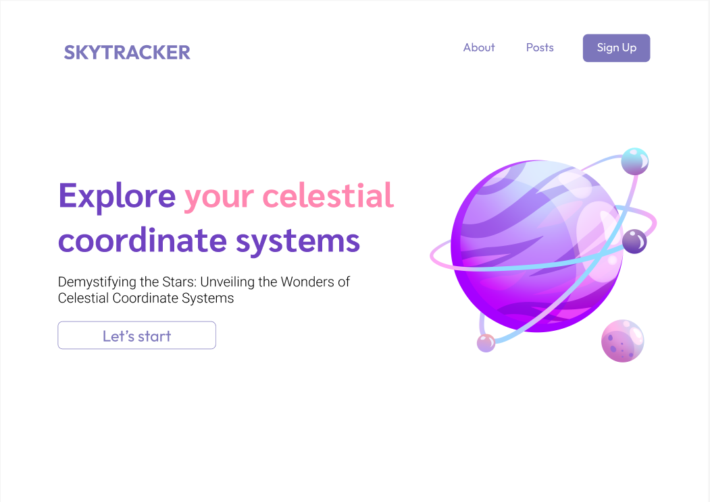
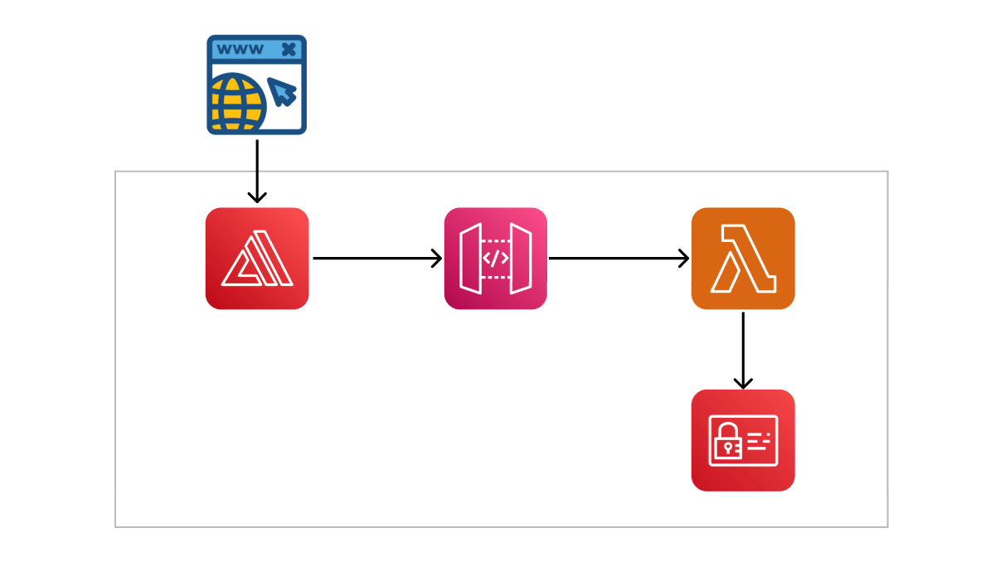

# sky-tracker
Hello, we are ***4str0holic***! Our team consists of two members who have a passion for tarot and astrology: Tram and An (that's how our team name was born). 

SkyTracker is a web application that we built for our AWS Cloud Training project. On this project, we focus on how we can implement AWS services to deploy a web application, not a deep dive into how to code to build one. So, our web seems kind of basic (we also cannot build more complicated, lol — at least now).

This is SkyTracker's web UI:

For the architecture of our implementation, you can see the diagram below:
